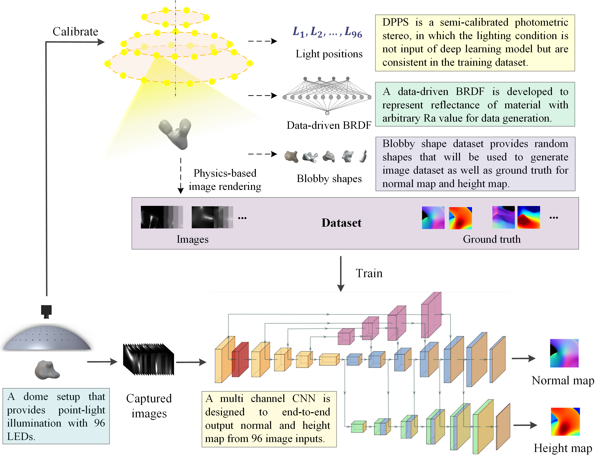

# DPPS: A deep-learning based point-light photometric stereo method for 3Dreconstruction of metallic surfaces
 
Note: We are still working on uploading more dataset.  

Three-dimensional (3D) measurement provides essential geometric information for quality control and processmonitoring in many manufacturing applications. Photometric stereo is one of the potential solutions for in-process metrology and active geometry compensation, which takes multiple images of an object under differentilluminations as inputs and recovers its surface normal map based on a reflectance model. Deep learningapproaches have shown their potential in solving the highly nonlinear problem for photometric stereo, butthe main challenge preventing their practical application in process metrology lies in the difficulties in thegeneration of a comprehensive dataset for training the deep learning model. This paper presents a newDeep-learning basedPoint-lightPhotometricStereo method, DPPS, which utilizes a multi-channel deep convolutionalneural network (CNN) to achieve end-to-end prediction for both the surface normal and height maps in a semi-calibrated fashion. The key contribution is a new dataset generation method combining both physics-based anddata-driven approaches, which minimizes the training cost and enables DPPS to handle reflective metal surfaceswith unknown surface roughness. Even trained only with fully synthetic and high-fidelity dataset, our DPPSsurpasses the state-of-the-art with an accuracy better than 0.15 cm over a 10 cm×10 cm area and its real-lifeexperimental results are on par with commercial 3D scanners. The demonstrated results provide guidanceon improving the generalizability and robustness of deep-learning based computer vision metrology withminimized training cost as well as show the potential for in-process 3D metrology in advanced manufacturingprocesses. 

## Dependencies
Deep-DIC is implemented in [PyTorch](https://pytorch.org/) and tested with Ubuntu 20.04, please install PyTorch first following the official instruction. 
- Python 3.7 
- PyTorch
- Torchvision
- PIL
- numpy
- scipy
- CUDA

## Overview
We provide:
- Datasets: training dataset, validation dataset and test dataset.
      (https://drive.google.com/drive/folders/1vQKFJTwOCwMEhoHOgzvymEVLw9W1Sr7p?usp=sharing)
- Pre-trained models:
      https://drive.google.com/drive/folders/1jnl9Wzi6DUvXWVuwimj6i0jAPaB0Nq3o?usp=share_link
- Code to train the DPPS with dataset.
- Calibrated lighting conditions.
